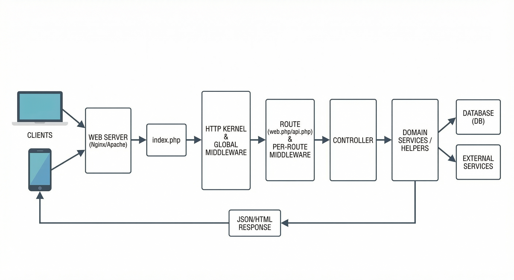

### `Multi-Service-V3` – Technical Documentation v2

**Audience**: Backend devs, mobile/API devs, DevOps, QA  
**Repo type**: Laravel multi-tenant, multi-segment “super-app” backend
---

### Table of Contents

- [1. System Overview](#1-system-overview)
- [2. Core Concepts (Tenancy, Auth, Locale, Storage)](#2-core-concepts-tenancy-auth-locale-storage)
    - [2.1 Multi-tenant Identification](#21-multi-tenant-identification)
    - [2.2 Auth Guards](#22-auth-guards)
    - [2.3 Locale & Translations](#23-locale--translations)
    - [2.4 Merchant-specific Storage & S3](#24-merchant-specific-storage--s3)
- [3. Tech Stack & High-level Architecture](#3-tech-stack--high-level-architecture)
    - [3.1 Tech Stack](#31-tech-stack)
    - [3.2 Layered Architecture](#32-layered-architecture)
    - [3.3 Request–Response Flow](#33-requestresponse-flow)
- [4. Codebase Structure](#4-codebase-structure)
- [5. Major Functional Domains](#5-major-functional-domains)
    - [5.1 Tenants & Segments](#51-tenants--segments)
    - [5.2 Authentication & Roles](#52-authentication--roles)
    - [5.3 Booking & Dispatch Domain](#53-booking--dispatch-domain)
- [6. API Contract](#6-api-contract)
    - [6.1 Headers, Auth, Locale](#61-headers-auth-locale)
    - [6.2 Request Enrichment by Middleware](#62-request-enrichment-by-middleware)
    - [6.3 CORS & Response Envelope](#63-cors--response-envelope)
- [7. Booking Lifecycle & Status Codes](#7-booking-lifecycle--status-codes)
    - [7.1 Entities in a Trip](#71-entities-in-a-trip)
    - [7.2 Status Codes](#72-status-codes)
    - [7.3 Ride-now vs Ride-later](#73-ride-now-vs-ride-later)
    - [7.4 Booking Expiry & History](#74-booking-expiry--history)
    - [7.5 OTP Verification](#75-otp-verification)
- [8. Payment Integrations](#8-payment-integrations)
    - [8.1 Structure](#81-structure)
    - [8.2 Generic Payment Flow](#82-generic-payment-flow)
- [9. Notifications & Communication](#9-notifications--communication)
- [10. Background Jobs, Cron & Queues](#10-background-jobs-cron--queues)
- [11. Operations: Setup, Deploy, Diagnostics](#11-operations-setup-deploy-diagnostics)
- [12. Extensibility Guidelines](#12-extensibility-guidelines)
    - [12.1 Adding an API Feature](#121-adding-an-api-feature)
    - [12.2 Adding a Payment Gateway](#122-adding-a-payment-gateway)
- [13. Security Hardening Checklist](#13-security-hardening-checklist)
- [14. Data Model & Routing (Reference)](#14-data-model--routing-reference)
    - [14.1 Core Entities (ER Reference)](#141-core-entities-er-reference)
    - [14.2 Routing Overview](#142-routing-overview)
- [15. Glossary](#15-glossary)

---

### 1. System Overview

**Project name**: `msv3_liveserver`  
**Purpose**: Multi-tenant, multi-segment platform for:

- Vehicle-based / Taxi, Food ,Grocery ,Laundry  services
- **Helper-based / Handyman** services
- **Corporate, hotel, franchise, and taxi-company** use-cases

The system supports multiple **merchant tenants**, each with its own configuration, service segments, and pricing. It exposes both **web/admin panels** and **JSON APIs** used by mobile apps and third-party systems.

At a high level, the platform centers around a rich **booking and dispatch** domain, multi-tenant configuration, and a large set of **payment** and **communication** integrations.

For onboarding, you should understand in order:

1. **Core concepts**: how merchants, auth, locale, and storage are resolved.
2. **Architecture and code structure**: where things live.
3. **API contract**: headers, envelopes, and middleware behavior.
4. **Booking lifecycle**: what a trip is and how it moves through states.
5. **Payments, notifications, cron/queues**: cross-cutting infrastructure.

---

### 2. Core Concepts (Tenancy, Auth, Locale, Storage)

These are the cross-cutting concerns that influence almost every feature.

#### 2.1 Multi-tenant Identification

API tenant context is derived using one of these inputs:

- **Merchant API keys (headers)**: `publicKey`, `secretKey`
    - Used by `App\Http\Middleware\ApiMiddleware` to load `Merchant` and merge merchant config values into the request.
- **Passport access token (header)**: `Authorization: Bearer <token>`
    - Resolves the user or driver via guards:
        - `api` (users)
        - `api-driver` (drivers)
- **Merchant access PIN (request field)**: `access_pin`
    - Alternative merchant lookup.

If none is present/valid, the middleware returns a JSON `unauthorised request`.

**Merchant-key preconditions** when using `publicKey` + `secretKey`:

- `ApplicationConfiguration`
- `ApplicationTheme`
- `BookingConfiguration`

If any of these are missing, the API returns a failure message so apps cannot operate with partially configured merchants.


#### 2.2 Auth Guards

From `config/auth.php`, the repo supports many guards.

- **Session guards (web/admin portals)**:
    - `merchant`, `taxicompany`, `franchise`, `hotel`, `corporate`, `business-segment`, `driver-agency`, `agent`, `laundry_outlet`, `handyman_store`, plus `user` and `driver` (for deletion web views).
- **Passport guards (API)**:
    - `api` (users)
    - `api-driver` (drivers)
    - `api_merchant` (merchant API)
    - `business-segment-api`
    - `vehicle_owner`

Practical rule: **web panels use session auth**, **mobile APIs use tokens or merchant keys**.

In `routes/web.php`:

- User/driver deletion flows use `auth:user` and `auth:driver`.
- Admin panels are protected by their respective guards plus `admin_language`.

#### 2.3 Locale & Translations

Two layers of localization:

- **Web locale (session)**:
    - `App\Http\Middleware\Language` uses `session('locale')`, default `en`.
- **API locale (header)**:
    - `App\Http\Middleware\ApiLogMiddleware` reads header `locale` (default `en`).

Helper `setLocal($locale = null)` sets locale from:

1. Explicit argument, else
2. Request header `locale`, else
3. `en`

##### Merchant-specific “string files”

`MerchantTrait::getStringFile()`:

- reads `merchants.string_file`
- expects file: `resources/lang/<locale>/<string_file>.php`
- falls back to `all_in_one` if missing

You will often see:

- `$string_file = $this->getStringFile(NULL, $merchantOrBooking->Merchant);`
- `trans("$string_file.completed")`


#### 2.4 Merchant-specific Storage & S3

The `s3` disk is configured **per request**:

- `setS3Config($merchant)` reads `merchant.file_system_config` JSON.
- If `merchant.parent_id` is present, it uses the parent merchant’s config.
- It writes values into `config('filesystems.disks.s3', ...)`.

Where this is invoked:

- **API**: `ApiS3Middleware`
- **Admin web**: `AdminS3`

Effect: every request (API or admin) operates on the correct merchant bucket.

Most merchant-owned files use keys like:

- `<merchant_alias_name>` + `<path from config/custom.php>` + `<filename>`

Helper `get_image(...)`:

- builds the object key using alias + path template
- returns a pre-signed AWS S3 URL
- uses different expiries depending on session context

Implications:

- Persist file identifiers (keys/filenames), not just pre-signed URLs.
- Any request that needs images must pass through S3-configuring middleware.
- Renaming `merchant.alias_name` without migrating objects can break image links.


---

### 3. Tech Stack & High-level Architecture

#### 3.1 Tech Stack

- **Framework**: Laravel (`laravel/framework ^9.0`)
- **Language**: PHP (`^8.1`; older docs mention `>=7.3`)
- **Database**: MySQL (via Eloquent ORM)
- **Frontend**:
    - Laravel 
- **Web entrypoint**: `public/index.php`
- **Jobs & scheduling**:
    - Laravel Queue
    - Cron (HTTP endpoints + `php artisan schedule:run`)
- **Key libraries** (partial):
    - `laravel/passport`, `spatie/laravel-permission`
    - `stripe/stripe-php`, and many regional gateways (Telebirr, Mpesa, OrangeMoney, etc.)
    - `barryvdh/laravel-dompdf`, `phpoffice/phpspreadsheet`
    - `aws/aws-sdk-php-laravel`, `intervention/image`, several SMS/email providers

#### 3.2 Layered Architecture

- **Presentation layer**
    - Web routes (`routes/web.php`) → Blade views in `resources/views`
    - JSON APIs (`routes/api.php`) for mobile apps / third parties
- **Application layer**
    - Controllers in `app/Http/Controllers/**`
    - Middleware in `app/Http/Middleware/**`
    - Form Requests in `app/Http/Requests/**`
- **Domain layer**
    - Eloquent models in `app/Models/**`
    - Traits in `app/Traits/**` for core domain logic (booking, merchants, drivers, responses, images, polylines)
    - Domain helpers in `app/Helpers/**`
    - Service controllers in `app/Services/**` (Normal, Outstation, Rental, Pool, Transfer, etc.)
- **Infrastructure layer**
    - `config/*.php`, `database/*`
- External APIs (payments, SMS, email, maps, push)


#### 3.3 Request–Response Flow

Typical request path for both web and API:

1. Client → Web server (Nginx/Apache).
2. `public/index.php` → HTTP kernel & global middleware.
3. Route resolution (`web.php` or `api.php`).
4. Per-route middleware (tenant, auth, S3, logging).
5. Controller → domain services/helpers → models/DB and external services.
6. Response returned as JSON or HTML (view).



---

### 4. Codebase Structure

- **`app/`**
    - `Http/Controllers/`
        - `Api`: mobile/3rd-party APIs (e.g. `Api\BookingController`)
        - `Merchant`: merchant admin portal
        - `Taxicompany`, `Franchise`, `Hotel`: admin panels
        - `PaymentMethods`: per-gateway controllers/folders
        - `CronJob`: HTTP-triggered cron tasks
        - `Helper`, `Services`, etc.
    - `Http/Middleware/`: auth guards, language, tenant setup, S3 config, logging.
    - `Models/`: domain entities (e.g. `Booking`, `User`, `Driver`, `Segment`, `PriceCard`, `PaymentMethod`)
    - `Console/`: Artisan commands and scheduling (`Console\Kernel`)
    - `Helpers/`: shared helper classes and common logic
    - `Traits/`: reusable logic (`BookingTrait`, `ApiResponseTrait`, `MerchantTrait`, `DriverTrait`, `ImageTrait`, `PolylineTrait`, etc.)
    - `Services/`: per-service-type workflow controllers
- **`routes/`**
    - `web.php`: web/admin routes
    - `api.php`: public and app-facing API routes + payment callbacks
    - `channels.php`: broadcast channels
    - `console.php`: console route definitions for scheduled commands
- **`resources/`**
    - `views/`: Blade templates for admin/web frontends
    - Localization and other assets
- **`config/`**
    - `app.php`, `auth.php`, `database.php`, `queue.php`, `services.php`, `custom.php`, `constant.php`, etc.
- **Other**
    - `public/`: web root (index.php, assets)
    - `storage/`: logs, cache, compiled views, uploads
    - `composer.json`, `package.json`, `webpack.mix.js`: dependency and build configuration

---

### 5. Major Functional Domains

#### 5.1 Tenants & Segments

- **Tenants (Merchants)**
    - Models like `Merchant`, `MerchantLocalization`, `MerchantMembershipPlan`, `MerchantNavigationDrawer` and others.
    - Many URLs use `{alias_name}` (e.g. `merchant/admin/{alias_name}/login`) for merchant context.
- **Segments & Services**
    - Models: `Segment`, `SegmentTranslation`, `ServiceType`, `ServiceTranslation`, `ServicePackage`, `SegmentPriceCard`.
    - Three main categories:
        - **Vehicle-based / Taxi, Food, Grocery, Laundry Outlet** (rides, outstation, rental, pooling, coffee shop, resturants, grocery shops, pharmacy)
        - **Helper-based / Handyman** (services by person)
    - Each merchant decides which segments are active and how pricing works per area.

##### 5.1.1 Business-segment (Food, Grocery, and other orders)

The **business-segment** group covers food, grocery, and other order-based services (often non-taxi). Key characteristics:

- Orders are typically **item-based** (menus, inventories) rather than pure origin–destination rides.
- There can be multiple roles:
    - End-user placing orders.
    - Store/outlet (business-segment user) preparing or fulfilling orders.
    - Drivers/delivery agents handling logistics (pickup and drop of goods).

Important components:

- Models for **stores/outlets**, menus, categories, and items (names differ per implementation but follow common Laravel patterns).
- Controllers under merchant or business-segment namespaces for:
    - Managing stores and menus from admin panels.
    - Handling order creation, status updates (e.g. accepted, prepared, out for delivery, delivered, cancelled).
- APIs for mobile/web:
    - Browsing segments and stores.
    - Adding items to cart and placing orders.
    - Tracking order and driver status.

Many booking/dispatch ideas from the taxi flow still apply, but:

- Distance/time logic can be different (e.g. single pickup from store, multiple drops).
- Pricing can mix **per-item** and **per-distance** components.

##### 5.1.2 Laundry outlet

The **laundry outlet** segment focuses on garments and cleaning services:

- Orders contain line items like **wash**, **dry clean**, **iron**, often with quantity and item type.
- Statuses typically include:
    - Order placed
    - Accepted / In processing
    - Ready for pickup / Ready for delivery
    - Completed / Cancelled

Key parts of the system:

- Outlet management:
    - Outlet users with their own login (often via a dedicated guard such as `laundry_outlet`).
    - Configuration of pricing per garment type and service type.
- Logistics:
    - Pickup and drop can be handled by drivers (similar to delivery segments) or by customers directly.
    - Bookings or tasks can be created for drivers to pick up garments from the customer and return them after processing.

Laundry flows often reuse:

- **Booking**-like concepts for pickup/delivery.
- **Business-segment**-style order tables for items and services per garment.

##### 5.1.3 Handyman and handyman_store

The **handyman** segment deals with on-site services by professionals (plumbers, electricians, cleaners, etc.). `handyman_store` usually refers to a store or hub managing multiple service providers or inventory.

Common patterns:

- Services are defined as **tasks** or **jobs** with:
    - Category (e.g. plumbing, cleaning).
    - Base charges (visit fee, hourly rate, or per-task rate).
    - Optional materials or add-ons.
- Bookings can be:
    - **Scheduled**: similar to ride-later, with time windows.
    - **On-demand**: immediate or near-immediate dispatch of nearby providers.

System responsibilities:

- Store/handyman admin panels:
    - Manage available services and pricing.
    - Approve or onboard service providers.
    - View and manage bookings/orders, including cancellations and rescheduling.
- APIs for handyman apps:
    - Accept/reject jobs.
    - Update status (en route, arrived, started, completed).
    - Handle materials used, additional charges, and evidence (photos).

Handyman-specific considerations:

- **Duration-based billing**: jobs may be billed based on time spent; ensure that start/end timestamps are accurate.
- **Materials tracking**: when materials are supplied by the store, inventory and costing must be updated accordingly.
- **Safety/compliance**: some services might require extra documents or verification (e.g. licenses), often managed via document upload segments and admin approval.

#### 5.2 Authentication & Roles

Multiple guards/portals:

- **End-users**
    - Routes like `user/{alias_name}/login`, `user/details`, `user/delete`
    - Guard: `auth:user`
- **Drivers**
    - Routes like `driver/{alias_name}/login`, `driver/details`, `driver/delete`
    - Guard: `auth:driver`
- **Business-segment users**
    - Guard: `auth:business-segment-user`
- **Admins**
    - Merchant admin: `merchant/admin/...`
    - Taxi company admin: `taxicompany/admin/...`
    - Franchise admin: `franchise/admin/...`
    - Hotel admin: `hotel/admin/...`

Additional segment-specific roles:

- **Business-segment users (food/grocery/laundry/handyman_store)**:
    - Guard: `auth:business-segment-user` (or similar).
    - Responsibilities:
        - Manage store profile, operating hours, and coverage areas.
        - Manage menus/inventory or services.
        - Accept, reject, or manage orders originating from end-users.
- **Laundry outlet users**:
    - Guard: `laundry_outlet` (or an equivalent).
    - Focused on order intake, status updates through cleaning stages, and coordination with drivers for pickup/delivery.
- **Handyman-specific admins / coordinators**:
    - May exist as a subtype of merchant or business-segment admin.
    - Responsible for assigning jobs to specific handymen and managing schedule conflicts.

Roles & permissions:

- Uses `spatie/laravel-permission`
- Models: `Role`, `Permission`
- Area/segment-aware access control for different admin roles.

#### 5.3 Booking & Dispatch Domain

Key models (partial):

- **Booking core**
    - `Booking`, `BookingDetail`, `BookingTransaction`, `BookingCoordinate`, `BookingConfiguration`, `BookingRating`, `BookingRequestDriver`
- **Related**
    - User side: `User`, `UserDetail`, `UserDevice`, `UserWalletTransaction`, `GuestUser`
    - Driver side: `Driver`, `DriverVehicle`, `DriverSubscriptionRecord`, `DriverWalletTransaction`, `DriverOnlineTime`, etc.
    - Geo & pricing: `Country`, `CountryArea`, `PriceCard`, `PriceCardSlab`, `PriceCardValue`, `OutstationPackage`, `RouteConfig`
    - Segmentation: `Segment`, `ServiceType`, `ServicePackage`

Central logic:

- `app/Http/Controllers/Api/BookingController`:
    - Booking creation, status, OTP verification, payment flow
    - Driver assignment and ride lifecycle
    - Uses traits `BookingTrait`, `ApiResponseTrait`, `MerchantTrait`, `DriverTrait`, `ImageTrait`, `PolylineTrait`.
- `app/Models/Booking`:
    - ID generation, relationships to user, driver, merchant, price card, payment method, etc.
    - Helper methods to compute upcoming/active bookings.

---

### 6. API Contract

#### 6.1 Headers, Auth, Locale

Common headers:

- **Tenant / auth**
    - `publicKey` + `secretKey` (merchant key auth), or
    - `Authorization: Bearer <token>` (Passport user/driver tokens)
- **Localization**
    - `locale: en` (or another supported locale)

Templates:

- **Public call using merchant keys**
    - `publicKey: <merchantPublicKey>`
    - `secretKey: <merchantSecretKey>`
    - `locale: en`
- **Authenticated user call**
    - `Authorization: Bearer <user_access_token>`
    - `locale: en`
- **Authenticated driver call**
    - `Authorization: Bearer <driver_access_token>`
    - `locale: en`

#### 6.2 Request Enrichment by Middleware

When `ApiMiddleware` / `DriverApi` resolves a merchant, it merges values into the request for controllers.

Examples:

- **User-side (`ApiMiddleware`) merges**:
    - `merchant_id`
    - `gender`, `smoker`
    - `user_email_enable`, `user_phone_enable`
    - `user_cpf_enable` (when available)
    - `login_type`
    - `referral_code_mandatory_user_signup`
- **Driver-side (`DriverApi`) merges**:
    - `merchant_id`
    - `gender`, `smoker`
    - `driver_email_enable`, `driver_phone_enable`
    - `driver_login_type`
    - `driver_commission_choice`
    - `driver_address_enable`
    - `referral_code_mandatory_driver_signup`

#### 6.3 CORS & Response Envelope

- **CORS (from `routes/api.php`)**
    - `Access-Control-Allow-Origin: *`
    - `Access-Control-Allow-Headers: *`
    - `Access-Control-Allow-Methods: GET, POST, PATCH, PUT, DELETE, OPTIONS`

- **Response envelope (via `ApiResponseTrait`)**
    - Success: `{"version":"<api_version>","result":"1","message":"...","data":{...}}`
    - Failure: `{"version":"<api_version>","result":"0","message":"..."}`
    - Pending: `{"version":"<api_version>","result":"2","message":"..."}`
    - `version` resolved per merchant from `VersionManagement.api_version` (default `"1.5"`).

API middleware pipeline (from `app/Http/Kernel.php`):

- `throttle:10000,1`
- `bindings`
- `ApiLogMiddleware` (locale from header)
- `ApiS3Middleware` (dynamic S3 config)
- Per-route middleware: `merchant` (`ApiMiddleware`), `auth:api`, `auth:api-driver`, etc.

---

### 7. Booking Lifecycle & Status Codes

#### 7.1 Entities in a Trip

A complete trip spans multiple tables/models:

- **Root**: `Booking`
- **Metadata**: `BookingDetail`
- **Coordinates/route**: `BookingCoordinate`
- **Driver offers**: `BookingRequestDriver` (plus bidding tables if enabled)
- **Money**: `BookingTransaction`
- **Feedback**: `BookingRating`

Each booking is tied to:

- `Merchant`
- `User`
- `Driver` and `DriverVehicle`
- `CountryArea` (rules + timezone)
- `Segment`, `ServiceType`, `VehicleType`, `PriceCard`

#### 7.2 Status Codes

## 7.2 Status Codes

### (TAXI and TAXI DELIVERY)

- **1000**: New In Drive Booking
- **1001**: New Booking
- **1002**: Accepted by Driver
- **1012**: Partial Accepted
- **1003**: Arrived at Pickup
- **1004**: Ride Started
- **1005**: Ride Completed
- **1006**: Cancelled by User
- **1007**: Cancelled by Driver
- **1008**: Cancelled by Admin
- **1016**: Auto Cancelled
- **1018**: Expired by Cron

---

## 7.3 Driver Document Status

- **0**: PENDING
- **1**: UPLOADED
- **2**: APPROVED
- **3**: REJECTED
- **4**: EXPIRED

## 7.4 Vehicle Status

- **1**: Active
- **2**: Inactive
- **3**: Reject

---

## 7.5 User Vehicle Status

- **0**: Pending with Document
- **1**: Pending
- **2**: Verified
- **3**: Rejected
- **4**: Expired

---

## 7.6 Driver Signup Flow Status

- **1**: Add Basic Information
- **2**: Add More Information
- **3**: Add Segment Group
- **4**: Add Personal Document
- **5**: Add Vehicle
- **6**: Add Vehicle Document
- **7**: Add Segment + Service
- **8**: Add Availability Mode
- **9**: Approved

---

## 7.7 Booking Request Driver Status

- **1**: Sending, In Progress
- **2**: Accepted
- **3**: Rejected
- **4**: Cancelled

---


#### 7.3 Ride-now vs Ride-later

- **Ride-now**: `booking_type = 1`
- **Ride-later**: `booking_type = 2`

Ride-later bookings have extra cron logic (dispatch windows, expiry, corporate approval, timezone correctness) implemented in `Helper\BookingScheduleHelper`.

Key points:

- Cron periodically selects eligible ride-later bookings by time window and status.
- It adjusts for `CountryArea.timezone`.
- It uses `ride_later_on_admin_request_time` (merchant config) to decide dispatch timing.
- If eligible, it dispatches to drivers (notifications); otherwise it may expire bookings (status `1018`).


#### 7.4 Booking Expiry & History

Per-minute cron code (e.g. `expireInDriverAndTaxiBooking`) updates:

- `booking_status` → `1018` when expired.
- `booking_status_history` JSON by appending:
    - `booking_status`
    - `booking_timestamp`
    - Optional `latitude` / `longitude`
    - `from` (source tag string)

This history is critical for debugging why a ride expired.

#### 7.5 OTP Verification

Example: `Api\BookingController::BookingOtpVerify()`:

- Verifies OTP against `bookings.ride_otp`.
- Sets `ride_otp_verify = 3` on success.
- Uses a short cache mechanism (`timestampvalue`) to avoid repeated verification calls.

---

### 8. Payment Integrations

#### 8.1 Structure

- **Routes** (mostly `routes/api.php`):
    - For each gateway, routes for initiation/redirect and callback/notification.
- **Controllers** under `app/Http/Controllers/PaymentMethods/**`:
    - Namespaces like `Stripe`, `TelebirrPay`, `Mpesa`, `ESewa`, `Razorpay`, `PayFast`, `Pagadito`, `CashFree`, `Mercado`, `AamarPay`, `HyperPay`, `PeachPayment`, `Paygate`, `Yoco`, `Tingg`, `Tap`, `Tripay`, `JazzCash`, etc.
- **Configuration & logs**:
    - `PaymentMethod`, `PaymentMethodTranslation`
    - `PaymentOptionsConfiguration`, `PaymentConfiguration`
    - Transaction logs: `BookingTransaction`, `TripayTransaction`, `DpoTransaction`, `BookeeyTransaction`, etc.

#### 8.2 Generic Payment Flow

Typical payment flow:

1. User app requests booking and chooses payment method.
2. `Api\BookingController` creates `Booking` and `BookingTransaction`.
3. Controller invokes `PaymentMethods\<Gateway>Controller` to initiate payment.
4. Gateway presents hosted payment page or redirect to user.
5. Gateway calls the configured callback URL.
6. Payment controller verifies payload, updates `BookingTransaction` and `Booking.payment_status`.
7. Updated booking and payment status are returned to client.


---

### 9. Notifications & Communication

- **Push notifications**
    - OneSignal integration with models: `Onesignal`, `OneSignalLog`, `DefaultOnesignal`, `MerchantWebOneSignal`.
    - Controllers/events trigger user/driver notifications (e.g. payment method change, booking updates).
- **SMS**
    - Models: `SmsConfiguration`, `SmsGateways`.
    - Controllers like `SmsGateways\SimpleSms`, `Helper\SmsController`.
- **Email**
    - Events: `SendUserInvoiceMailEvent`, `SendDriverInvoiceMailEvent`.
    - Models/templates: `EmailTemplate`, `EmailConfig`, `EmailInvoiceIssuerConfig`.
    - PDF/Excel generation via `dompdf`, `PhpSpreadsheet` and export controllers.
- **WhatsApp / In-app calling**
    - `Merchant\WhatsappController` and Twilio-related routes.
    - `InAppCallingConfigurations`, `InAppCallings` for VoIP-like interactions.

---

### 10. Background Jobs, Cron & Queues

- **Cron-style HTTP routes** (in `routes/web.php`):
    - `/per-minute-functionalities`, `/every-day-functionalities` → `CronJob\CronController`.
    - Subscription-related endpoints → `CronJob\PerMinuteCronController`.
- **Per-minute booking bundle** (`PerMinuteCronController::booking()`):
    - Ride expiry (now + later).
    - Order expiry (food/grocery/business segment).
    - Subscription expiry/activation.
    - Driver location updates.
    - Driver assignment checks for admin-scheduled rides.
    - Driver auto-offline policies.
    - Stripe payout processing.
- **Per-day bundle** (`PerDayCronController`):
    - Document reminders.
    - Subscription expiry.
    - Handyman/order maintenance and related tasks.
- **Queue configuration** (from `config/queue.php`):
    - Default: `QUEUE_DRIVER` (defaults to `database`).
    - Supported: `database`, `redis`, `sqs`, `beanstalkd`, `sync`, `null`.
    - Failed jobs stored in `failed_jobs`.


---

### 11. Operations: Setup, Deploy, Diagnostics

#### Local setup (typical Laravel workflow)

From `msv3_liveserver/`:

- `composer install`
- Configure `.env` (DB, cache, queue, filesystem, mail).
- `php artisan key:generate`
- `php artisan migrate`
- If using Passport tokens: `php artisan passport:install`

#### Environment configuration (high level)

Treat `.env` as secrets.

Required categories:

- **Laravel runtime**: `APP_ENV`, `APP_DEBUG`, `APP_URL`
- **Database**: `DB_*`
- **Queue**: `QUEUE_DRIVER` and driver-specific settings
- **Redis** (if used): `REDIS_*`
- **AWS/S3**: base `AWS_*`, plus merchant-specific bucket config in DB
- **Mail/SMS/Push**: provider credentials
- **Payments**: gateway keys (often per merchant/country in DB)

#### Scheduling recommendation

- Prefer OS-level cron: run `php artisan schedule:run` every minute.
- If HTTP cron routes are used, protect them (token/IP allowlist).

#### Logging & diagnostics

Where to look:

- Laravel logs: typically `storage/logs/laravel.log`
- Custom logs: `location_queue.log`, `location_queue_error.log` in project root.
- Cron-specific log channel: `per_minute_cron_log` (see `config/logging.php`).

Common failure modes:

- **`unauthorised request` (API)**:
    - Missing/invalid keys, token, or disabled merchant/user/driver.
- **Merchant not found / config missing**:
    - Merchant exists but required DB objects (application/theme/booking config) are not present.
- **HTTP 409 during file operations**:
    - `setS3Config()` aborts when `merchant.file_system_config` is empty/invalid.
- **Broken/expired image links**:
    - Client is caching pre-signed URLs instead of requesting fresh ones.

---

### 12. Extensibility Guidelines

#### 12.1 Adding an API Feature

- **Route**
    - Add endpoint in `routes/api.php` under a suitable prefix and guard.
- **Controller**
    - Implement logic in `app/Http/Controllers/Api/<Feature>Controller.php`.
    - Use `ApiResponseTrait` for consistent JSON responses.
    - Use `MerchantTrait` and segment helpers when tenant-specific behavior is required.
- **Validation & Models**
    - Use `FormRequest` classes for complex validation.
    - Add/update Eloquent models and migrations in `app/Models` and `database/migrations`.

#### 12.2 Adding a Payment Gateway

- **Model & config**
    - Add `PaymentMethod` entry and configuration via `PaymentOptionsConfiguration` / `PaymentConfiguration`.
- **Controller**
    - Create `app/Http/Controllers/PaymentMethods/<Gateway>/<Gateway>Controller.php`.
    - Implement:
        - Initiation method (create payment, return redirect URL or token).
        - Callback method (verify gateway payload, update `BookingTransaction` and `Booking.payment_status`).
- **Routes**
    - Register initiation and callback endpoints in `routes/api.php`.
- **Security**
    - Validate signatures, IPs, and tokens in controller or middleware.

---

### 13. Security Hardening Checklist

- **Remove or protect utility endpoints**
    - `/clear-cache`, `/queue-start`, `/queue-restart` should not be publicly accessible.
- **Protect cron endpoints**
    - `/per-minute-functionalities`, `/every-day-functionalities` must be guarded (or replaced by OS-level cron).
- **Revisit CORS**
    - Currently wide open (`*` for origin and headers); tighten per environment.
- **Tune rate-limiting**
    - Default API throttle is `10000/min`; reduce to realistic limits per endpoint.
- **S3 signed URL expiry**
    - Ensure sensitive documents use appropriate expiries.
- **Least privilege**
    - Confirm admin portals are behind the right guards and roles (`spatie/laravel-permission`).

---

### 14. Data Model & Routing (Reference)

This section is primarily for reference for our schema design,  once you understand the earlier concepts.

#### 14.1 Core Entities (ER Reference)

Key relationships:

- A `USER` can create many `BOOKING`s.
- A `DRIVER` can serve many `BOOKING`s.
- A `MERCHANT` owns many `BOOKING`s.
- A `BOOKING`:
    - Has one `BOOKINGDETAIL`.
    - Has one `BOOKINGTRANSACTION`.
    - Is associated to one `PRICECARD`, `COUNTRYAREA`, `SERVICETYPE`, `VEHICLETYPE`.
- `USER` and `DRIVER` each have many wallet transactions.
- A `MERCHANT` configures many `SEGMENT`s, which define many `SEGMENTPRICECARD`s and `SERVICEPACKAGE`s.
- `BOOKINGREQUESTDRIVER` models offers sent to drivers and links bookings to candidate drivers.
- `BOOKINGRATING` stores feedback for completed bookings.


#### 14.2 Routing Overview

**`routes/web.php`** – main groups:

- **Utility**
    - `/`, `/home`, `/404`
    - `/clear-cache`, `/queue-start`, `/queue-restart`
- **Account deletion flows**
    - User: `user/{alias_name}/login`, `user/details`, `/user/delete`
    - Driver: `driver/{alias_name}/login`, `driver/details`, `/driver/delete`
    - Business segment user: `business-segment/user/...`
- **Taxi company admin (`taxicompany/admin`)**
    - Login, dashboard, drivers, bookings, maps, transactions, ratings, exports, etc.
- **Franchise admin (`franchise/admin`)**
    - Similar scope to taxi-company, but franchise-specific.
- **Hotel admin (`hotel/admin`)**
    - Manual dispatch, bookings, ratings, profile, wallet.
- **Merchant admin (`merchant/admin`)**
    - Large configuration surface for pricing, services, documents, content, settings, etc.

**`routes/api.php`** – main categories:

- **Core APIs**
    - Booking status endpoints (`/check-booking-status`, `/bookingStatus`).
    - Test utilities (`/test`, `/time`, `/estimate`, etc.).
- **Payment callbacks**
    - Stripe, Telebirr, Mpesa, Momo, BillBox, CashPay, Razorpay, 2C2P, EasyPay, ESewa, FlexPay, PayFast, Mercado, Edahab, PayBox, MIPS, Waafi, PayPal, JazzCash, Tripay, CashPlus, Bookeey, Wave, Yoco, Tingg, Tap, and more.
- **3rd-party/special integrations**
    - Butler APIs, Meta verify webhook, Wasl integration, UniWallet, PawaPay, Hubtel, etc.
- **Location / driver**
    - Location and tracking endpoints (e.g. `Api\DriverController@Location`).

---

### 15. Glossary

- **Merchant**: Tenant account owning configuration, segments, pricing, and storage rules.
- **Alias name**: `merchants.alias_name`, used in S3 key prefixes and some URLs.
- **Segment**: High-level module (Taxi, Delivery, Food, Grocery, Handyman, etc.).
- **ServiceType**: Sub-service within a segment (e.g. “Normal”, “Rental”, “Outstation”).
- **CountryArea**: Geographic + timezone boundary for pricing/rules/scheduling.
- **Booking type**:
    - `1`: Ride-now
    - `2`: Ride-later
- **Passport**: Laravel OAuth/token auth used by `auth:api`, `auth:api-driver`, etc.

---

### 16. Deep Dive & Practical Cookbook

This appendix provides **more detailed**, scenario-based explanations for developers who already understand the main sections but need concrete guidance for day-to-day work.

#### 16.1 End-to-end example: create and complete a ride-now booking (API-level)

This example uses a **simplified** flow and field set; refer to actual controllers and requests for the full contract.

1. **Bootstrap config**
    - Mobile app calls a bootstrap endpoint (e.g. `/user/bootstrap`) with:
        - `publicKey`, `secretKey`
        - `locale`
    - Expected result:
        - Merchant configuration (supported segments, allowed countries/areas, feature flags).
        - Application configuration (ride-later support, wallet support, referral rules, etc.).
    - Things to verify:
        - Merchant has `ApplicationConfiguration`, `ApplicationTheme`, `BookingConfiguration` enabled.
        - Mobile app stores `merchant_id` and relevant flags if they are returned.

2. **Fare estimation**
    - App calls an estimation endpoint (e.g. `/estimate`) with:
        - pickup and drop coordinates
        - selected `segment_id`, `service_type_id`, `vehicle_type_id`
        - maybe coupon or promo code
    - Backend work (high-level):
        - Resolves price card based on `CountryArea`, `Segment`, `ServiceType`, and `VehicleType`.
        - Applies merchant configuration (minimum fare, surge rules, taxes, etc.).
    - The response includes estimated fare ranges, ETA, distance, and textual messages.

3. **Create booking**
    - App sends a booking creation request (ride-now):
        - `booking_type = 1`
        - Coordinates, addresses, segment/service/vehicle identifiers.
        - Chosen `payment_method` (e.g. cash, wallet, card).
        - Any additional metadata (e.g. note to driver, corporate account references).
    - Controller side (simplified):
        - Validates request fields (often with a `FormRequest`).
        - Creates `Booking` with status typically set to `1001` (New ride).
        - Inserts `BookingDetail` with route and address information.
        - Creates `BookingTransaction` with amount, currency, initial status (e.g. pending).
        - If pre-authorization is required for card/wallet, may start a payment sub-flow here.

4. **Dispatch to drivers**
    - Dispatch logic:
        - Identifies candidate drivers around pickup using `CountryArea`, driver statuses, and potentially segment/vehicle filters.
        - Creates one or more `BookingRequestDriver` entries, with timestamps and possibly per-driver expiry.
        - Sends push notifications to drivers via OneSignal or another channel.
    - Things that can vary per merchant:
        - Whether requests go out sequentially or in parallel.
        - How long a driver has to accept.
        - How many drivers can be offered at once.

5. **Driver accepts and trip starts**
    - A driver app call (with driver token) accepts the booking:
        - Controller validates that booking is in a state eligible for acceptance (e.g. `1001` or `1019`).
        - Status transitions to `1002` (Accepted).
        - `BookingRequestDriver` records are updated to reflect acceptance/rejection.
    - Driver arrives on location:
        - Status transitions to `1003` (Arrived).
    - Trip start:
        - Often requires OTP verification; on success:
            - `ride_otp_verify` updated (e.g. `3`).
            - Status transitions to `1004` (Started).

6. **Complete trip and settle payment**
    - Driver ends trip:
        - Backend computes final fare using:
            - Actual distance and time (from `BookingCoordinate` or external map APIs).
            - Price card slabs, taxes, surcharges, discounts.
        - `BookingTransaction` is updated with final amount, any gateway/fee data.
        - Wallet, payout, or post-paid logic may run depending on payment method.
        - Status transitions to `1005` (Completed).
    - User rating:
        - User submits feedback; `BookingRating` is created and linked to the booking.

7. **Post-trip processing**
    - Cron/queue may:
        - Send invoice emails.
        - Trigger loyalty/referral flows.
        - Update analytics tables or export data for BI.

#### 16.2 Example payloads (simplified)

These are **illustrative** only. Real endpoints can differ in exact fields and naming.

- **Create booking request (user app)**

```json
{
  "pickup_lat": 12.9716,
  "pickup_lng": 77.5946,
  "drop_lat": 12.9250,
  "drop_lng": 77.5938,
  "segment_id": 1,
  "service_type_id": 2,
  "vehicle_type_id": 3,
  "booking_type": 1,
  "payment_method": "cash",
  "note": "Please call when you arrive"
}
```

- **Create booking response (success, shortened)**

```json
{
  "version": "1.5",
  "result": "1",
  "message": "Booking created",
  "data": {
    "booking_id": 12345,
    "booking_status": 1001,
    "booking_status_text": "New ride"
  }
}
```

Always cross-check actual payloads with the controllers and feature-specific documentation before coding clients.

#### 16.3 Troubleshooting checklists

##### 16.3.1 Booking-related issues

When debugging issues where bookings appear stuck or “missing”:

1. **Check the current status** in the `booking` table and compare against `booking_status_history`.
2. Verify that per-minute cron (`/per-minute-functionalities`) is running; if not, expiry and auto-dispatch may not fire.
3. Confirm that the relevant drivers are:
    - Online in the correct `CountryArea`.
    - Associated with the right `Segment` and `VehicleType`.
4. For ride-later, confirm:
    - `booking_type = 2`.
    - Scheduled time and timezone are correct.
    - Corporate/approval flags are in the expected state.

##### 16.3.2 Payment-related issues

For payment or reconciliation issues:

1. Check the `BookingTransaction` record for the booking:
    - Amount, currency, status.
    - Gateway reference IDs.
2. Look at gateway-specific transaction tables (e.g. `TripayTransaction`, `DpoTransaction`) if they exist.
3. Inspect payment gateway callback logs (web server logs and any custom log channels).
4. Confirm that:
    - Callback URLs are accessible from the gateway’s infrastructure.
    - Signature or HMAC validation passes.
    - Idempotency is handled correctly (duplicates should not change final state).

##### 16.3.3 Multi-tenant or locale issues

1. Inspect incoming headers (`publicKey`, `secretKey`, `locale`).
2. Ensure `ApiMiddleware` and `ApiLogMiddleware` are present on the route.
3. Confirm merchant status and configuration (app/theme/booking config).
4. Check that translation files (`resources/lang`) contain the expected keys for the resolved `string_file`.

#### 16.4 Performance and scaling notes

- **Database hot-spots**:
    - Booking and related tables can become large; consider indexing:
        - `merchant_id`, `country_area_id`, `segment_id`, `booking_status`, and time-based columns used by cron.
    - For analytics or dashboards, pre-compute aggregates rather than querying raw bookings each time.
- **Queue workers**:
    - Scale workers horizontally as notification and payment volumes grow.
    - Separate queues (e.g. `high`, `default`, `low`) can isolate latency-critical jobs from heavy background processing.
- **Caching**:
    - Merchant configurations that rarely change can be cached (e.g. in Redis) to reduce DB load.
    - Be careful to invalidate caches when merchant settings are updated from admin panels.

#### 16.5 Safe development practices

- Always **develop and test** against non-production merchants and environments.
- Use feature flags or merchant-level toggles for experimental features.
- When changing booking or payment flows:
    - Add logs that include merchant, booking, and transaction identifiers (but avoid sensitive data).
    - Coordinate with mobile/web teams for any changes in the required fields or response formats.
- Keep **migration scripts** backward compatible where possible, especially for high-volume tables like `booking` and `booking_transaction`.

